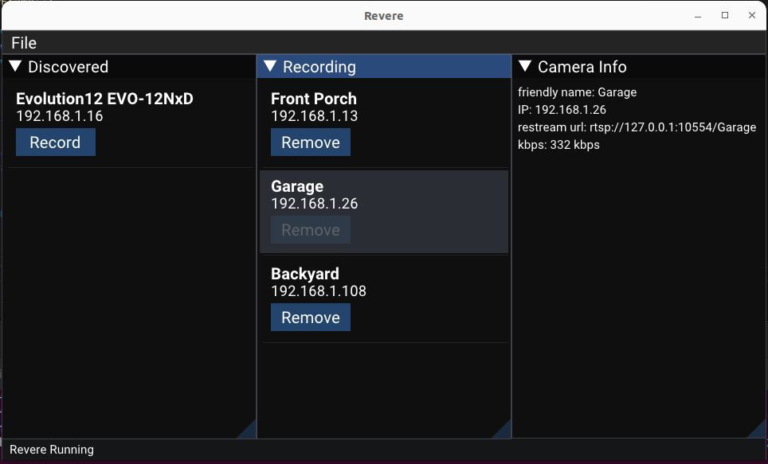
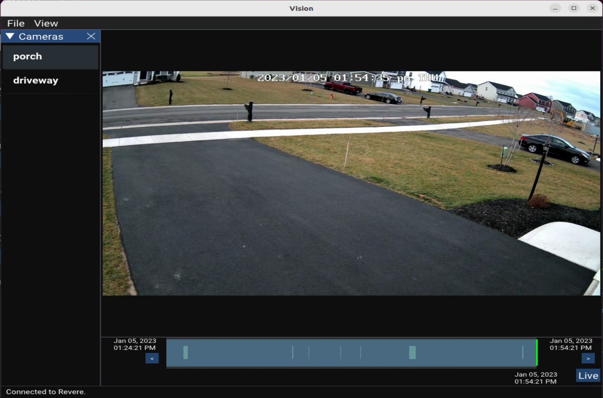

# Revere
## Open Source Video Surveillance
### Features
- Onvif camera compatibility & discovery
- H.264, H.265, AAC, G.711, G.726
- Up to 4K resolutions
- Windows & Linux support
- Unobtrusive background application that will only use the disk space you allocate to it.





### What Works
- Onvif camera discovery
- Recording
- RTSP restreaming
- Live viewing
- Scrub Bar
- Motion Detection
- Extensive REST API: (/cameras,/contents,/jpg,/motions,/export), etc.
- Exports

## How to Get It

### Linux
The easiest way to get Revere on Linux is from the Snap package available at: https://snapcraft.io/revere
This snap has been tested on the current version of Ubuntu & Fedora.

### Windows
The easiest way to get Revere on Windows is by download a release package here from github: https://github.com/dicroce/revere/releases

### Api
The Revere background process has an extensive API. Firstly, all recording cameras live streams are available via a centralized RTSP link:

`rtsp://127.0.0.1:10554/porch`

where porch is the friendly name of the camera. The rest of the API's
are REST / Json based and are available on port 10080.

All times are accepted and returned as ISO 8601 time strings: 2023-02-26T12:00:00.000

Here is a brief overview:

`http://127.0.0.1:10080/cameras`

Returns a list of known and recording cameras.

    {
      "cameras": [
        {
          {
            "audio_codec": "mpeg4-generic",
            "camera_name": "IPC-BO RLC-810A",
            "do_motion_detection": true,
            "friendly_name": "porch",
            "id": "cc492272-fab1-d4e9-cc6f-d84b3a963cec",
            "ipv4": "192.168.1.12",
            "rtsp_url": "rtsp://192.168.1.12:554/",
            "state": "assigned",
            "video_codec": "h264"
          },
          {
            "audio_codec": "",
            "camera_name": "AXIS Camera",
            "do_motion_detection": false,
            "friendly_name": "",
            "id": "9b7c4835-2f83-532b-48ef-28037ae65b74",
            "ipv4": "169.254.41.241",
            "rtsp_url": "",
            "state": "discovered",
            "video_codec": ""
          }
        }
      ]
    }

Note: the first camera here state is "assigned", which means its recording. The second camera state is "discovered" which means its
been found on the network but not yet recording.

`http://127.0.0.1:10080/jpg`

Returns a jpg transcoded from the frame closest to the provided time.

Required Arguments
camera_id, start_time

Optional Arguments
width, height

`http://127.0.0.1:10080/key_frame`

Returns the key frame from the camera bitstream nearest the provided time.

Required Arguments
camera_id, start_time

`http://127.0.0.1:10080/contents`

Returns an array of time segments representing periods of continuous
recording available.

Required Arguments
camera_id, start_time, end_time

Optional Arguments
media_type ["video" or "audio"]

    {
      "segments": [
        {
          "start_time": "2023-02-26T10:00:00.000",
          "end_time": "2023-02-26T11:00:00.000"
        }
      ]
    }

`http://127.0.0.1:10080/export`

Request a containerized video file (mov, etc) be created in Revere's export folder for a particular camera at a particular time range. Does not transcode.

Required Arguments
camera_id, start_time, end_time, file_name

`http://127.0.0.1:10080/motions`

Return a json representation of the raw motion data for a requested camera and time range.

Required Arguments
camera_id, start_time, end_time

Optional Arguments
motion_threshold

    {
      "motions": [
        {
          "time": "2023-02-26T10:00:00.000",
          "motion": 7,
          "avg_motion": 7,
          "stddev": 7
        }
      ]
    }

`http://127.0.0.1:10080/motion_events`

Joins close motion data into logical events with a start and end time.

Required Arguments
camera_id, start_time, end_time

Optional Arguments
motion_threshold

    {
      "motion_events": [
        {
          "start_time": "2023-02-26T10:00:00.000",
          "start_time": "2023-02-26T10:00:08.000",
          "motion": 7,
          "avg_motion": 7,
          "stddev": 7
        }
      ]
    }

## Compiling on Ubuntu Desktop 22.04 LTS

1) Update your system.
2) If this is a virtualbox VM
  - Have the guest additions installed
  - Have at least 64gb of vram.
  - Choose bridged networking for Onvif camera discovery
3) Base packages
```
sudo apt install git curl zip unzip tar cmake pkg-config nasm libxinerama-dev libxcursor-dev xorg-dev libglu1-mesa-dev bison python3-distutils flex libgtk-3-dev libayatana-appindicator3-dev libunwind-dev build-essential
```
4) Building
```
git clone https://github.com/dicroce/revere --recursive
mkdir revere/build && pushd revere/build && cmake .. && make && sudo make install
```
At this point you should have revere installed in /usr/local/revere and vision installed in /usr/local/vision

## Compiling on Windows
1) Download and install git for windows from https://git-scm.com
2) Download and install Visual Studio 2019 (free Community edition is fine since Revere is opensource).
3) Launch the Git Bash prompt that comes with git for windows.
4) Type the following commands
```
git clone https://github.com/dicroce/revere --recursive
mkdir revere/build && pushd revere/build && cmake .. && cmake --build . --target install
```
NOTE: the "cmake --build . --target install" target works on Windows but it has to be run from a Git Bash shell run with Administrator privelages. It will install Revere and Vision to C:\Program Files (x86)\revere.

## Attributions
Revere was developed using these great open source projects

nlohmann/json
https://github.com/nlohmann/json

Dear Imgui
https://github.com/ocornut/imgui

libonvif
https://github.com/sr99622/libonvif

Gstreamer
https://gstreamer.freedesktop.org/

FFmpeg
https://ffmpeg.org/

SQLite
https://sqlite.org/

Vcpkg
https://github.com/dicroce/vcpkg
